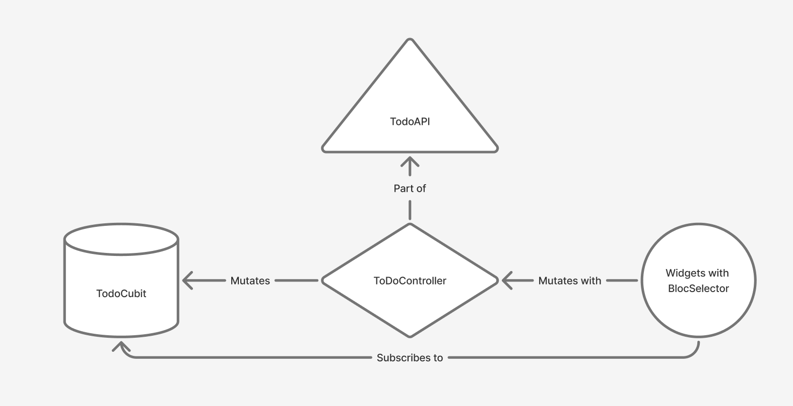

# Kalachakra Todo Flutter Reyhan

## Running Project

This app is available at: <https://kalachakra-todo-flutter-reyhan.web.app>

If you want to run locally:

1. flutter pub get
2. flutter run -d chrome --web-experimental-hot-reload
3. To build: flutter build web

## Technical Overview

This ToDo app utilizes Bloc state managements with Flutter and a MVC architecture approach.



Models, Views, and Controllers are seperated into distinct classes in the `models`, `views`, and `controllers` folder respectively. Currently, there is only 1 MVC for the Todo feature.

The `Todo` class only store data for the Todo entity with helpers to encode/decode the data from/to JSON.This class does not contain any business logic.

To manage the data and interact with the ToDO API, the `TodoController` class is used. It is seperated into 2 components:

1. `TodoCubit`: the Bloc store for todos. It contains the todos state, the user queries state, and methods to interact with the data on the client side only.
2. `TodosApi`: uses HTTP package to interact with the ToDo API backend.

Those 2 components are further combined in multiple methods inside of `TodoController` with the optimistic UI update approach. Anytime the Widgets (views) wants to interact with todos data, they have to use `TodoController` instead of the cubit or API. The `TodoController` methods would first update the Cubit state first so the user can see their changes immediately, then utilizes the API to update the server.

Then any views (widgets) can subscribe to the `TodoCubit` using `BlocSelector` so they only re-render when a specific part of the state they subscribe to is changed.

## Folder Structure

```
└── 📁lib
    └── 📁controllers
        └── 📁todo
            ├── todo_api.dart // Interact with the Todo API using http package
            ├── todo_controller.dart // Combines TodoCubit and TodoApi to provide optimistic UI updates
            ├── todo_cubit.dart // Stores and share data using Bloc
    └── 📁models
        └── 📁enums
        ├── todo.dart // The Todo model class
    └── 📁views
        └── 📁components
            └── 📁buttons // Common buttons
            └── 📁dialogs // Common dialogs
            └── 📁inputs // Common inputs
            └── 📁todo_filter // Todo filter button baased on completion
            └── 📁todo_list // The todo list
        └── 📁themes // ThemData
            ├── colors.dart // Primitive Colors
            ├── dark_theme.dart // Dark mode ThemeData for Adaptivetheme
            ├── light_theme.dart // Light mode ThemeData for Adaptivetheme
            ├── text.dart // TextThemes using Google Fonts
        └── 📁todo_screen // The ToDo screen for user interaction
        └── 📁utils
            ├── router.dart // GoRouter config
    └── main.dart // main app
```

## Task Progress

- [X] Create Todo
- [X] Get All Todo
- [X] Apply Filters on Get All Todo
- [X] Mark Todo as Done / Undone
- [X] Update Todo
- [X] Delete Todo
- [X] Dark mode

## Features

### Material + Custom Widgets + Adaptivetheme

`MaterialApp` is used as the base widget where I created custom widgets to fit the Figma design better. For dark mode switching, Adaptivetheme package is used to switch between 2 ThemeData for light and dark mode.

### Go Router

Go Router is used to handle the app routing instead of using the base `Navigator.

### API Interaction using http package and TodoApi

Interacting with the api uses the http package and abstracted into the `TodoApi` class that provides methods to CRUD the Todo API.

### Optimistic UI Updates with Bloc TodoCubit, BlocSelector, and TodoController

`TodoCubit` is the source-of-truth for all todo data, so each widget can subcribe to the data using `BlocSelector` or the cubit instantly using `context.read<TodoCubit>()` when necessary. Widgets interact with the `TodoApi` through the `TodoController` that updates the `TodoCubit` state first and then synchronizing data with the `TodoApi`.

For now, the `TodoController` does not revert changes if an error occurs.
